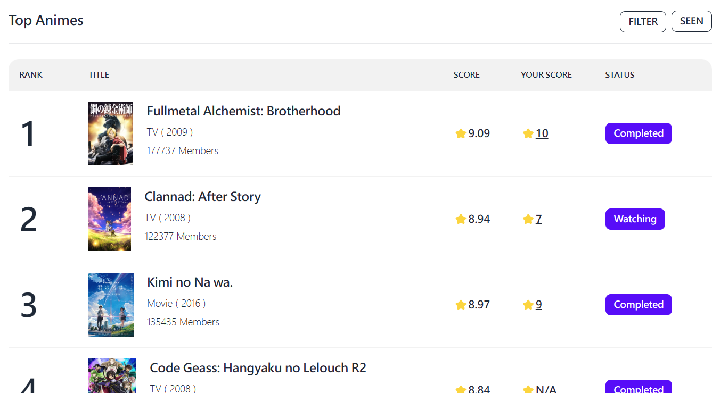

# AnimeDBMS Website Frontend side

[](https://choosealicense.com/licenses/mit/)

This is a website that uses **Daisy UI** and React js. It has **fully customizable and themable CSS** CSS and is powered by Tailwind CSS utility classes. Additionally, it comes with **redux toolkit** and other libraries already set up.

## Key Features

-   **Utilizes user ratings to curate** _Top Anime Selection_
-   **Details and statistical data** for each anime
-   **Text, Genre, and Letter search for animes**
-   **Management of watchlists, ratings, and reviews**
-   **Recommendation** for the most suitable anime to watch

## Preview



## Installation

Go to project directory and run (make sure you have node installed first)

```bash
  npm install
  npm start
```

## Core Libraries Used

-   [React JS v18.2.0](https://reactjs.org/)
-   [React Router v6.4.3](https://reactrouter.com/en/main)
-   [Tailwind CSS v3.2.4](https://tailwindcss.com/)
-   [Daisy UI v2.41.0](https://daisyui.com/)
-   [HeroIcons](https://heroicons.com/)
-   [Redux toolkit v1.9](https://redux-toolkit.js.org/)
-   [React ChartJS 2 v5](https://react-chartjs-2.js.org/)

## License

[](https://choosealicense.com/licenses/mit/)
